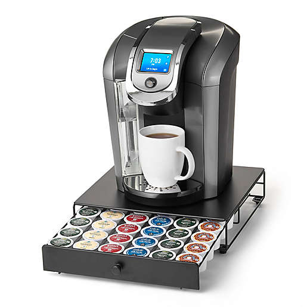

# Making Cup of Coffee - Kuerig

## Start

>>Functionality - User is wanting to make a cup of coffee.  User confirms power is on. User inserts KCUP.  User adds CoffeeMug.  User makes CoffeeCup. User decides to addSugar or not.  User decides to addCreamer or not.  User enjoys Coffee or not.

## Object/Data Structures

### Objects
* User
* Machine

### Variables for Machine
* Kuerig
* Pod
* Cup
* Cream
* Sugar
* Power
* Water
* User (for User Object)

### INIT
* CREATE Patron
* CREATE Kuerig
* CREATE KCup
* CREATE Water Level
* CREATE Coffee

### Program
* userPresent
* turnCoffeeOn
* addWater
* insertKCup
* addCoffeeMug
* makeCoffeeCup
* addSugar
* addCreamer

### Functions
* Confirm user is present
* Insert KCUP
* Set size
* Add Water
* Brew Cup
* Add Sugar/Creamer

### Steps
1. Turn machine on - turnCoffeeOn
    if machine = off
    user submits "on"
2. Add Water -addWater
    If water < minimum
        add water
    else if cup >= 2
        add water = maximum
3. Insert new KCUP - insertKCup
    if KCUP = 1
    Discard
    Replace with new KCUP
4. Place Mug Under Coffee Output/Machine - addCoffeeMug
5. Set size (array of ounces) -- possible add of increment/decrement. 
    a.  INPUT ounces
        case ounces of 
        6: PRINT "6oz"
        8: PRINT "8oz"
        10: PRINT "10oz"
        12: PRINT "12oz"
        ENDCASE

    b.
        If you want 8oz
        print oz = 8
        Else if you want 10oz
        print oz = 10
        else if you want 12 oz
        print oz = 12
        else if you want 6oz
        print oz = 6
6. Initiate Brew Coffee -makeCoffeeCup
7. Machine dispenses ozs from #5 array
8. Add Sugar -addSugar
    If sugar = false (0)
    Skip
    If sugar = true (>= 1)
    Add Sugar (Amount)
9. Add Creamer - addCreamer
    if creamer = false (0)
    Skip
    if creamer = true (>= 1)
    add Creamer (amount)
10. Stir Coffee
    if all contents added 
    then stir coffee
11. Enjoy Coffee
    if not enjoyed
    Repeat from step 2 OR end program

### End

* Possible additions/stretch
    * Boolean 
        * Coffee
            * If Coffee == false (not like it)
            return zero (end process)
        * Power
            * on = true; off = false;
    * Add Clean Function
        * if makeCoffeeCup > (num) THEN clean machine 
        
    